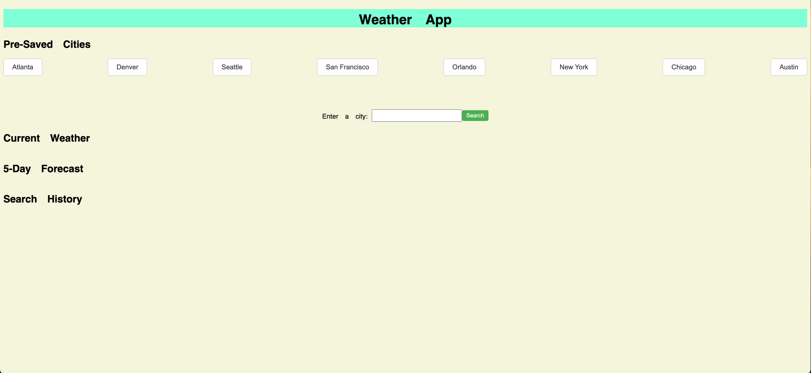
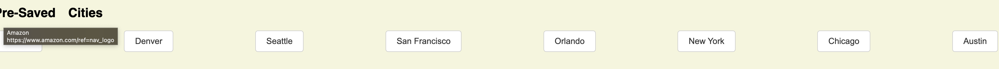
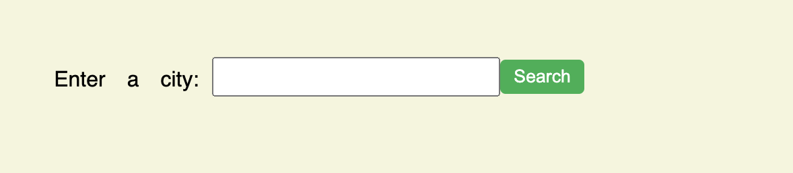
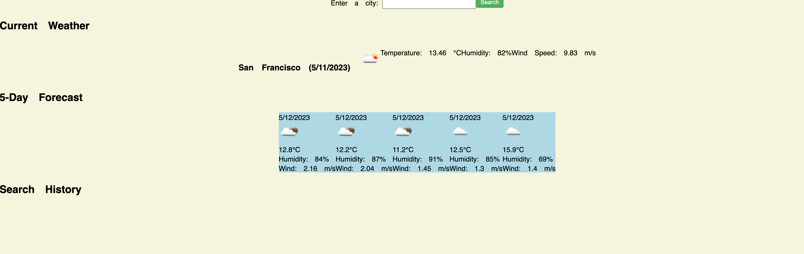

# Weather_Dashboard

## Description

The purpose of this project was to display the power of Java Script and API's. I used a weather API that displays the wether acording to the city that you input. 

## Table of Contents

- [Weather\_Dashboard](#weather_dashboard)
  - [Description](#description)
  - [Table of Contents](#table-of-contents)
  - [Installation](#installation)
  - [Usage](#usage)
  - [Credits](#credits)
  - [License](#license)

## Installation

N/A

## Usage

Now you can go about the web page and test your knologe of JS. Try to find the weather for the city you live in. You can go the website with this URL. 
https://jedichang99.github.io/Code-Quiz/

## Credits

N/A

## License

Please refer to the LICENSE in the repo.